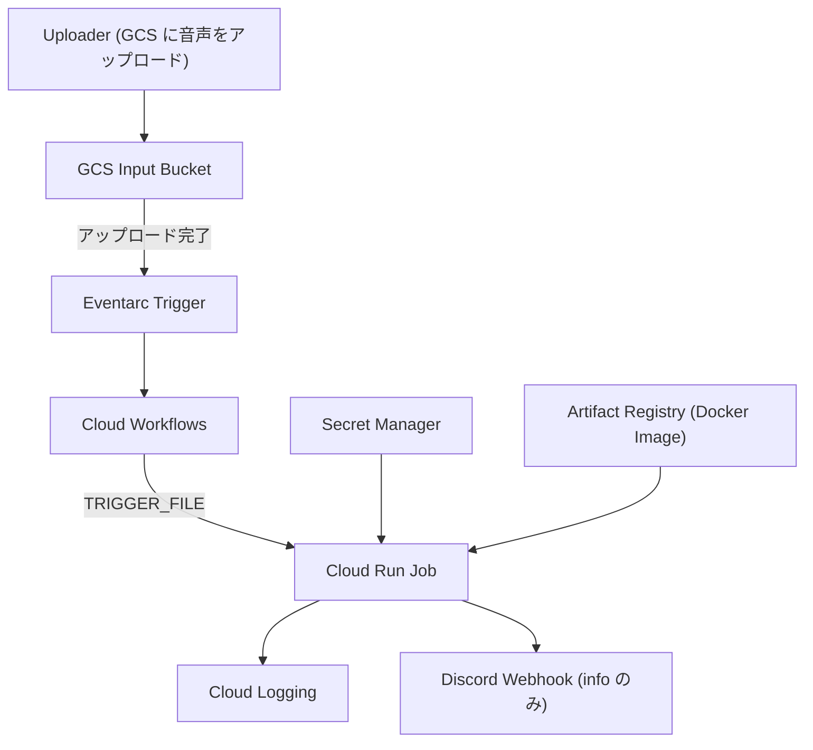

# アーキテクチャ

ここでは実装済みの構成に限定します。

## 1. リポジトリ構成

- `app/`
  - Python 3.12 の最小アプリ (`app/src/main.py`)
  - 環境変数の構造化ログと Discord Webhook 通知のみ
  - `app/Dockerfile` で Cloud Run Job 用イメージをビルド
- `infrastructure/`
  - Terraform による GCP 構成
  - `environments/dev|prod` に backend/variables
  - `modules/` に Artifact Registry と Cloud Run Job のカスタムモジュール

## 2. 実行時アーキテクチャ (Terraform が作るもの)

Terraform の定義から読み取れる構成は次の通りです。

### 2.1 GCS Input Bucket

- `google_storage_bucket.input` を作成
- バケット名: `${system}-audio-input-${environment}`（小文字化）
- `input_retention_days` が設定されている場合、オブジェクトの削除ライフサイクルを設定

### 2.2 Eventarc トリガー

- GCS の「アップロード完了（オブジェクト確定）」を受ける Eventarc トリガー
- 対象バケット: 上記 Input Bucket
- トリガー先: Cloud Workflows

### 2.3 Cloud Workflows

- `google_workflows_workflow.main`
- GCS イベントの `event.data.name` を `TRIGGER_FILE` として Cloud Run Job に渡す
- 末尾が `/` のオブジェクト名はスキップ（GCS の「フォルダ作成」プレースホルダーを想定）

### 2.4 Cloud Run Job

- `google_cloud_run_v2_job` を作成
- 実行イメージは Artifact Registry に push した Docker イメージ
- 主要な環境変数:
  - `INPUT_BUCKET` = Input Bucket 名
  - `DISCORD_WEBHOOK_INFO_URL` / `DISCORD_WEBHOOK_ERROR_URL` = Secret Manager から取得した値
  - `TRIGGER_FILE` = Workflows から渡されるオブジェクト名
- 設定値 (root `job.tf`):
  - timeout: `3600s`
  - memory: `8Gi`
  - cpu: `2`
  - max instances: `1`

### 2.5 Artifact Registry と Docker イメージ

- `modules/google/artifact_registry_docker_image` で Artifact Registry を作成
- `local-exec` で Docker build → tag → push
- 最新 `keep_count` は `image_keep_count` で制御（デフォルト 3）

### 2.6 Secret Manager

- Discord Webhook の Secret 名を変数で受け取り、`data.google_secret_manager_secret_version` で読み込み
- 取得した secret を Cloud Run Job の環境変数へ注入

### 2.7 IAM 付与 (主なもの)

- Cloud Run Job のサービスアカウントに以下の権限を付与
  - `roles/storage.objectAdmin` (Input Bucket)
  - `roles/logging.logWriter`
  - `roles/aiplatform.user`
  - `roles/eventarc.eventReceiver`
  - `roles/pubsub.publisher`
  - `roles/workflows.invoker`
  - `roles/run.admin`
- Eventarc サービスエージェントへの `roles/eventarc.serviceAgent`

## 3. アプリケーション (app/src/main.py)

Cloud Run Job で起動されるアプリは、テスト用に適当に作った簡易実装で、以下のみを実行します。

1. `DISCORD_WEBHOOK_INFO_URL` がある場合、開始メッセージを送信
2. 環境変数を JSON 形式でログ出力
3. `TRIGGER_FILE` があれば JSON 形式でログ出力
4. `DISCORD_WEBHOOK_INFO_URL` がある場合、完了メッセージを送信

音声処理・RSS 更新・R2 連携等は **実装されていません**。

## 4. CI/CD

### CI (`.github/workflows/ci.yml`)

- Python 3.12 + uv を使った lint/test
- Terraform の fmt/validate

### CD (`.github/workflows/cd.yml`)

- `main` → prod / `develop` → dev を自動デプロイ
- `workflow_dispatch` でブランチ指定デプロイ
- `make terraform-deploy-{dev,prod}` を実行

## 5. 現状の実装範囲

現時点の実装は **Terraform による GCP 基盤構築 + ルートの Cloud Run Job 実装のみ**であり、
以下はまだコード上に存在しません。

- 音声の解析・議事録/タイトル/概要の生成
- Cloudflare R2 へのアップロード
- RSS の更新
- Discord への詳細な投稿
